# Lorem Mermaid

Lorem ipsum dolor sit amet, one of each common mermaid diagram type. All dates
and values are fixed so the output is repeatable.

## Flowchart

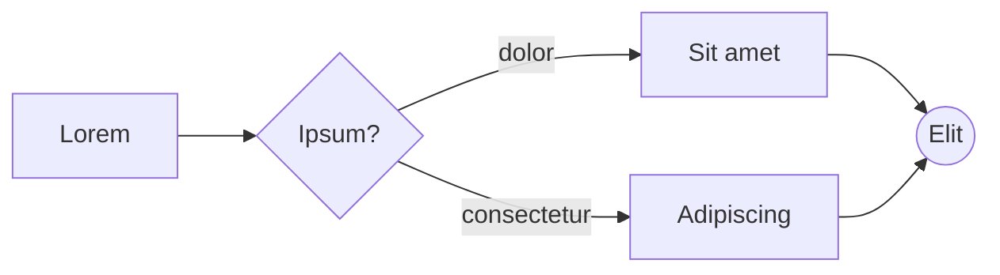

## Sequence

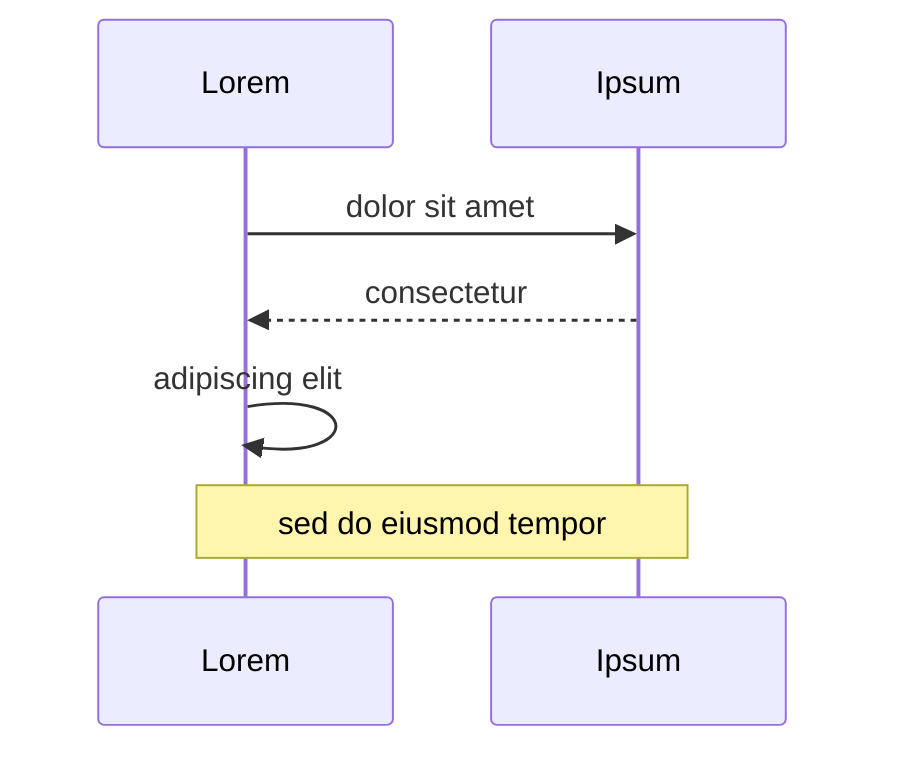

## Class

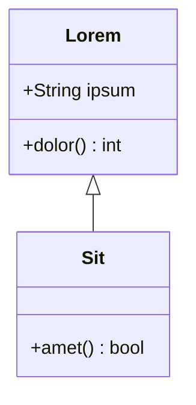

## State

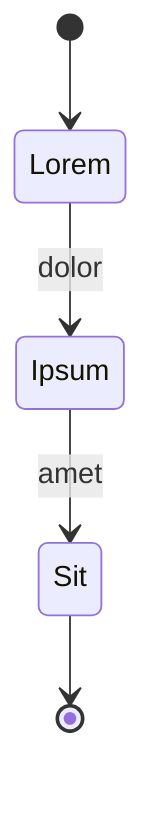

## Entity Relationship

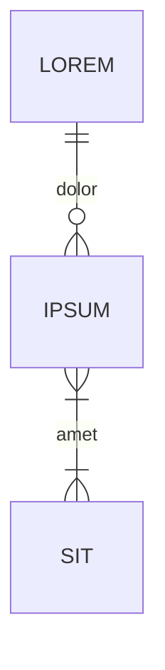

## Gantt

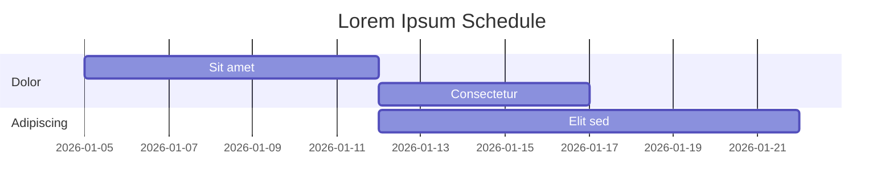

## Pie

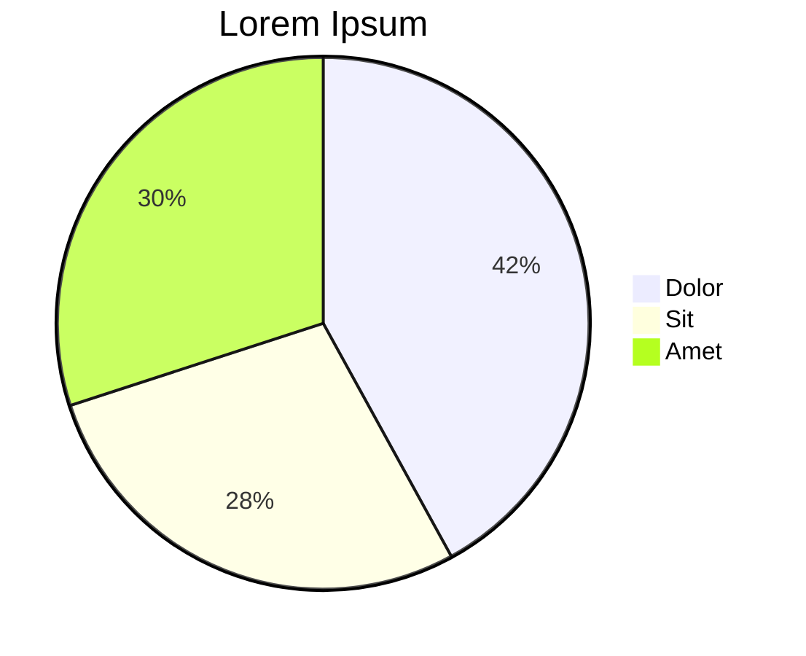

## Mindmap

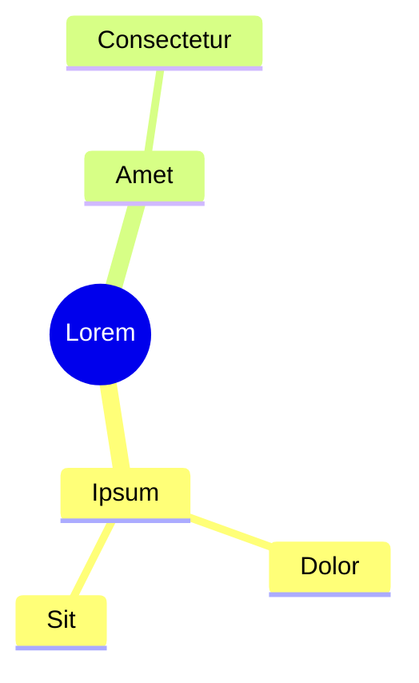

## Git Graph

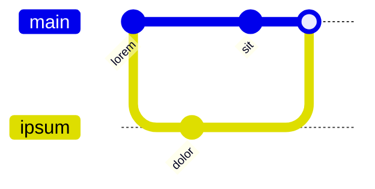

## Block

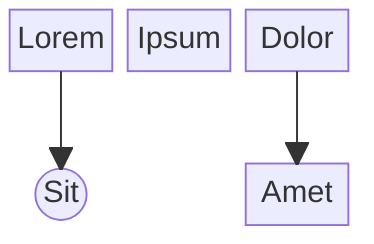

## Packet

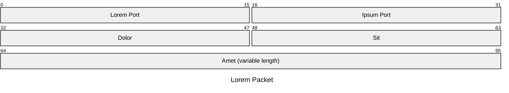

## Sankey

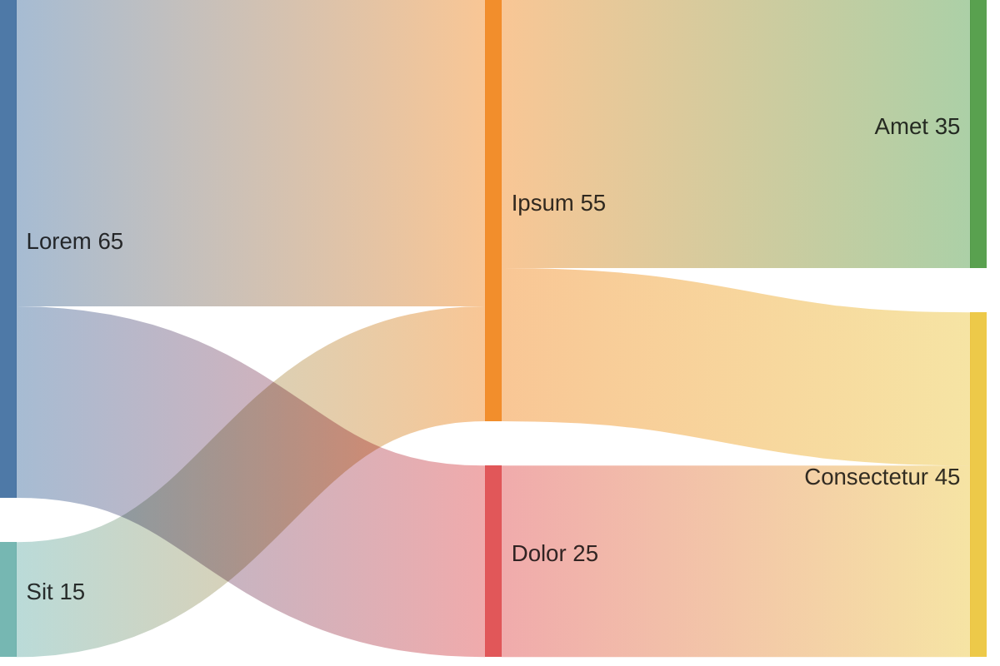

## XY Chart

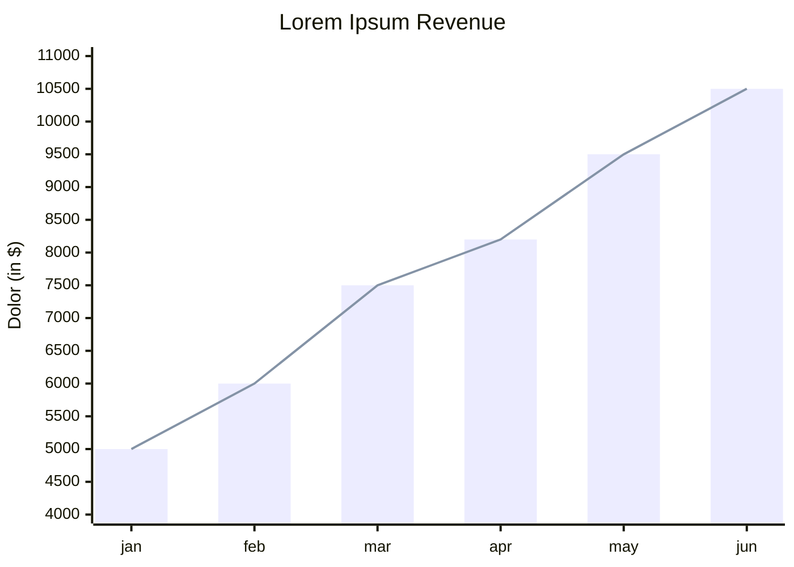

## Radar

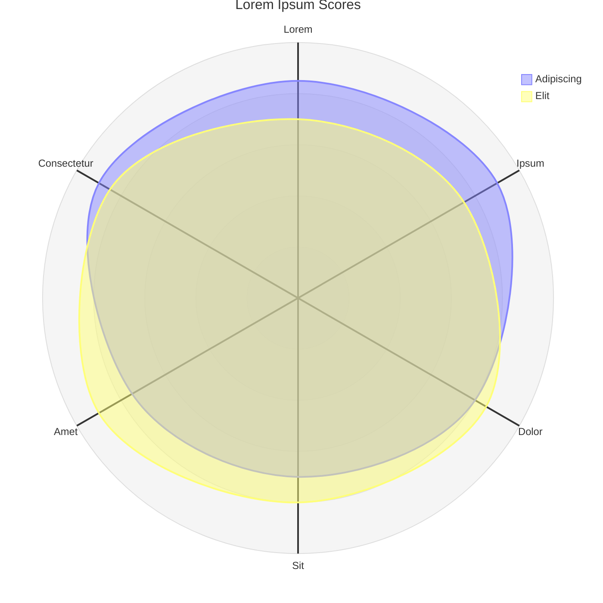

## Treemap

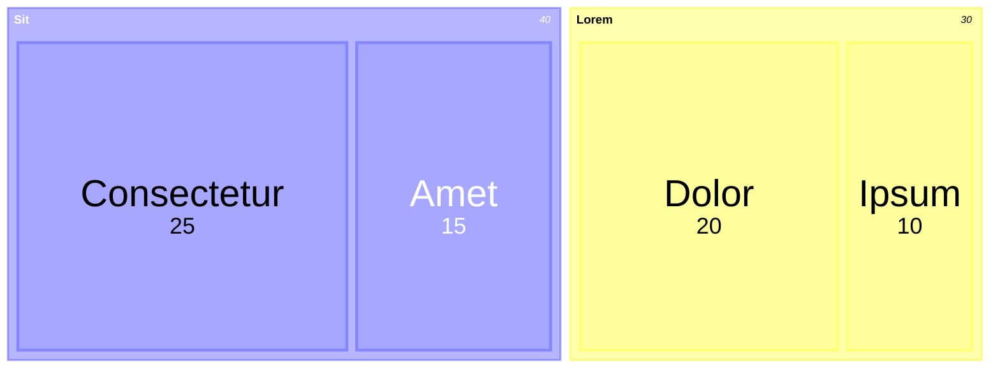

## Venn

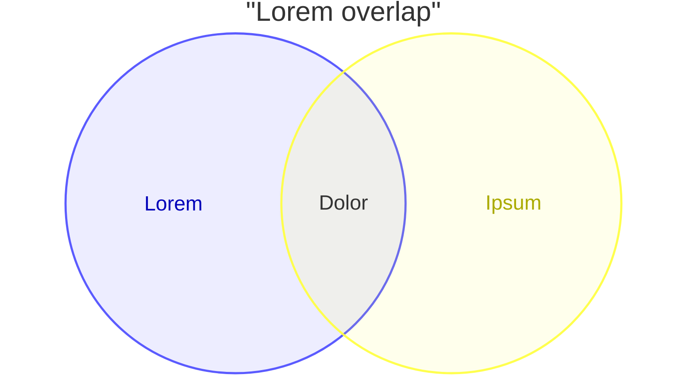

## Ishikawa

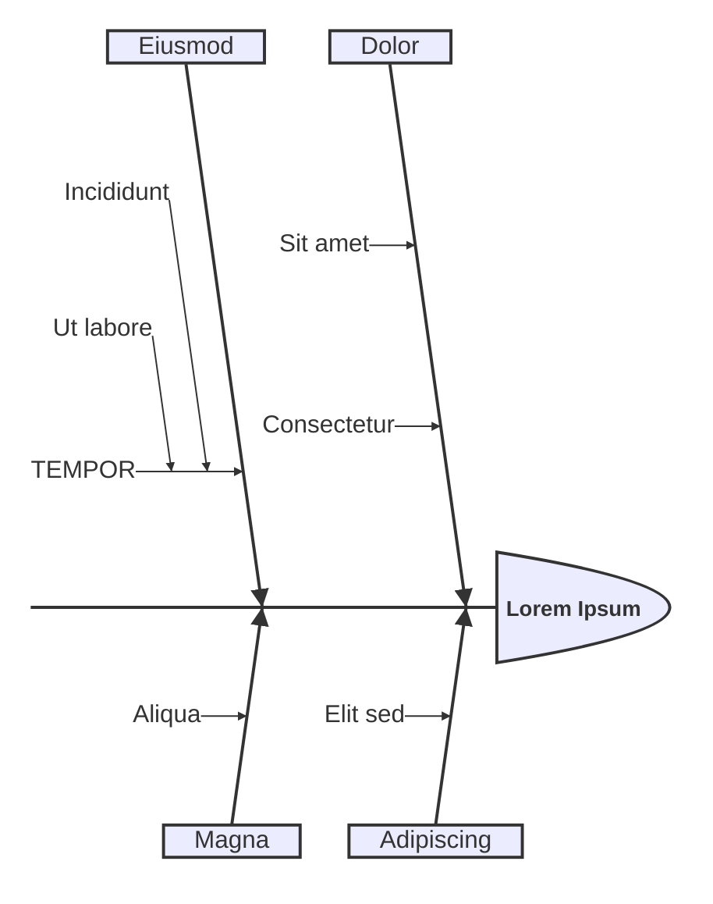

## Wardley

```mermaid
wardley-beta
title Lorem Value Chain

anchor Lorem [0.95, 0.63]
component Ipsum [0.79, 0.61]
component Dolor [0.63, 0.81]
component Sit [0.52, 0.80]
component Amet [0.43, 0.35]

Lorem -> Ipsum
Ipsum -> Dolor
Ipsum -> Sit
Sit -> Amet

evolve Amet 0.62

note "Consectetur adipiscing elit" [0.30, 0.49]
```

## Cynefin

```mermaid
cynefin-beta
  title Lorem Ipsum

  complex
    "Dolor sit amet"

  complicated
    "Consectetur adipiscing"

  clear
    "Sed do eiusmod"

  chaotic
    "Tempor incididunt"

  confusion
    "Ut labore"
```

## Swimlane

```mermaid
swimlane-beta LR
  subgraph Lorem
    a[Ipsum dolor]
    e[Sit amet]
  end

  subgraph Consectetur
    b[Adipiscing]
    c[Elit sed]
  end

  a --> b
  b -->|eiusmod| c
  c --> e
```

## Event Modeling

```mermaid
eventmodeling

tf 01 ui LoremUI
tf 02 cmd AddIpsum { dolor: string }
tf 03 evt IpsumAdded { dolor: string }
tf 04 rmo IpsumList
```

## Tree View

```mermaid
treeView-beta
├── lorem/
│   ├── ipsum.rs
│   └── dolor.rs
├── Cargo.toml
└── README.md
```

## Railroad

```mermaid
railroad-beta
title Lorem Grammar

lorem = sequence(
    nonterminal("ipsum"),
    zeroOrMore(sequence(
        choice(terminal("+"), terminal("-")),
        nonterminal("ipsum")
    ))
) ;
```

```mermaid
railroad-ebnf-beta
title "Lorem Digit"

digit = "0" | "1" | "2" | "3" | "4" | "5" | "6" | "7" | "8" | "9" ;
```

```mermaid
railroad-abnf-beta
title "Lorem Address"

address = local-part "@" domain ;
local-part = 1*( ALPHA / DIGIT / "." / "-" ) ;
domain = label *( "." label ) ;
label = 1*( ALPHA / DIGIT / "-" ) ;
```

```mermaid
railroad-peg-beta
title "Lorem Calculator"

Expression <- Term (("+" / "-") Term)* ;
Term <- Number (("*" / "/") Number)* ;
Number <- Digit+ ;
Digit <- "0" / "1" / "2" / "3" / "4" / "5" / "6" / "7" / "8" / "9" ;
```

## Invalid Diagram

The block below is intentionally broken, to show how render errors look.

```mermaid
flowchart LR
    A[Lorem --> B
```

Neque porro quisquam est, qui dolorem ipsum quia dolor sit amet.
